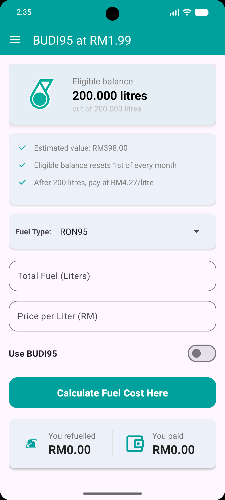
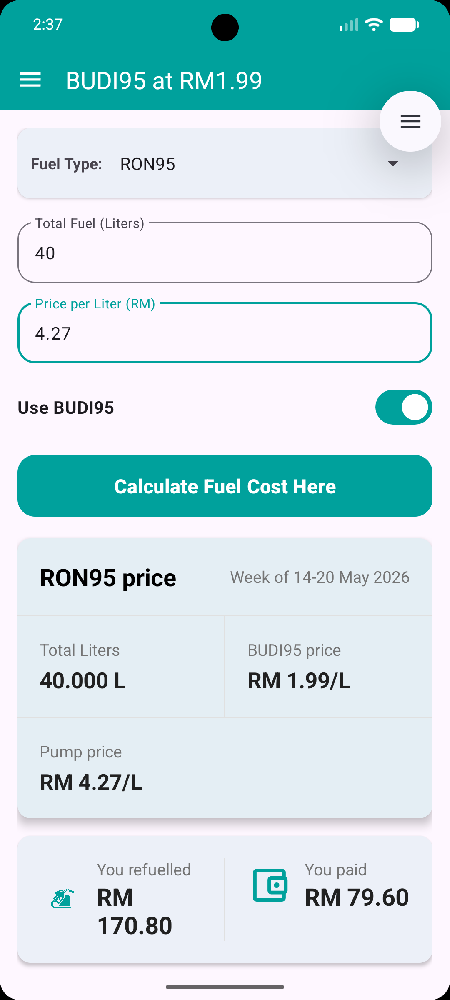
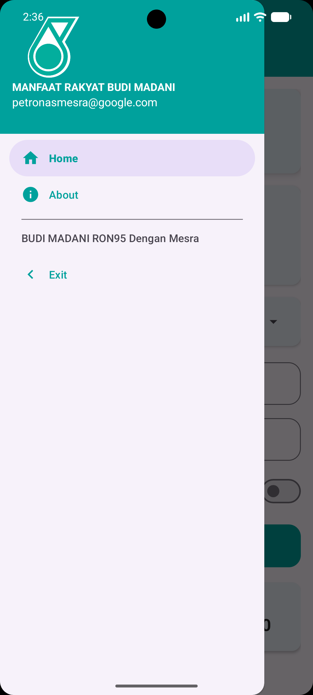
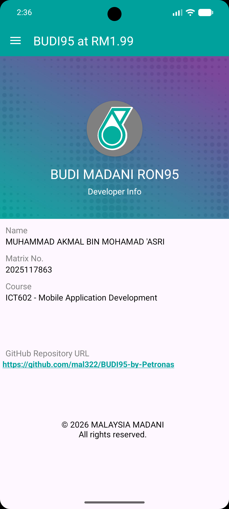
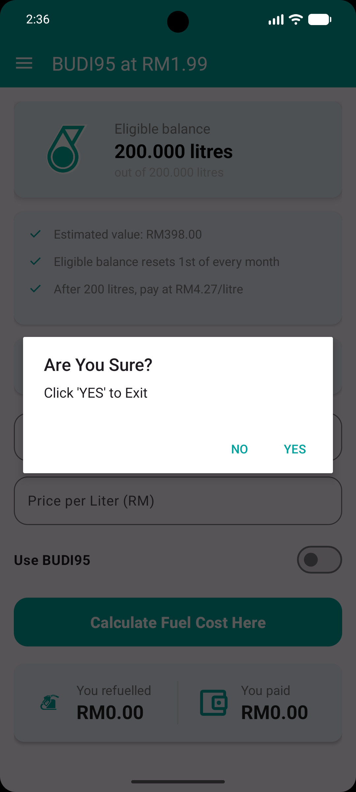

# BUDI95 Petrol Calculator (ICT602)

An Android mobile application designed to calculate fuel costs and monitor subsidies under the **BUDI MADANI RON95** targeted subsidy program in Malaysia. This project was developed as part of the **ICT602 - Mobile Application Development** course.

---

## 📱 App Features

* **Subsidy Balance Tracker:** Displays your eligible monthly quota (e.g., 200.000 liters) and tracks your remaining balance.
* **Fuel Cost Calculator:** Dynamically calculates total costs and total savings based on the current market pump price versus the subsidized BUDI95 price (RM1.99/L).
* **Toggleable Subsidy Mode:** A quick switch to calculate costs with or without the applied BUDI95 subsidy.
* **Navigation Drawer:** Simple sidebar navigation containing quick links to the Home screen and the About/Developer profile page.
* **Safe Exit Confirmation:** A dialog prompt that prevents accidental app closures.

---

## 📸 Screenshots
## 📸 Screenshots

| Home Screen (Empty State) | Cost Calculation (Active Subsidy) |
| :---: | :---: |
|  |  |

---

### Navigation Features

| Navigation Drawer | About Developer | Exit Page |
| :---: | :---: | :---: |
|  |  |  |

## 🧮 Calculation Logic & Example

The app dynamically calculates your expenses based on the following rules:
* **BUDI95 Subsidized Price:** RM1.99 / Liter
* **Monthly Quota Limit:** 200 Liters (resets on the 1st of every month).
* **Market Price:** Custom input (e.g., RM4.27 / Liter).

### Example Scenario:
If you refuel **40 Liters** when the market pump price is **RM4.27/L**:

* **Actual Market Value:** $40 \times \text{RM}4.27 = \text{RM}170.80$
* **What You Pay (Subsidized):** $40 \times \text{RM}1.99 = \text{RM}79.60$
* **Total Savings:** $\text{RM}170.80 - \text{RM}79.60 = \text{RM}91.20$

---

## 🛠️ Tech Stack & Development Environment

* **OS Platform:** Android
* **Course Code:** ICT602 - Mobile Application Development
* **Development Tools:** Android Studio, Java/Kotlin (as applicable)
* **UI Elements:** Material Design components, ScrollView, ConstraintLayout, Custom Toast alerts, and Dialogs.

---

## 👤 Developer Profile

* **Name:** MUHAMMAD AKMAL BIN MOHAMAD 'ASRI
* **Matrix No.:** 2025117863
* **Course:** ICT602 - Mobile Application Development

---
